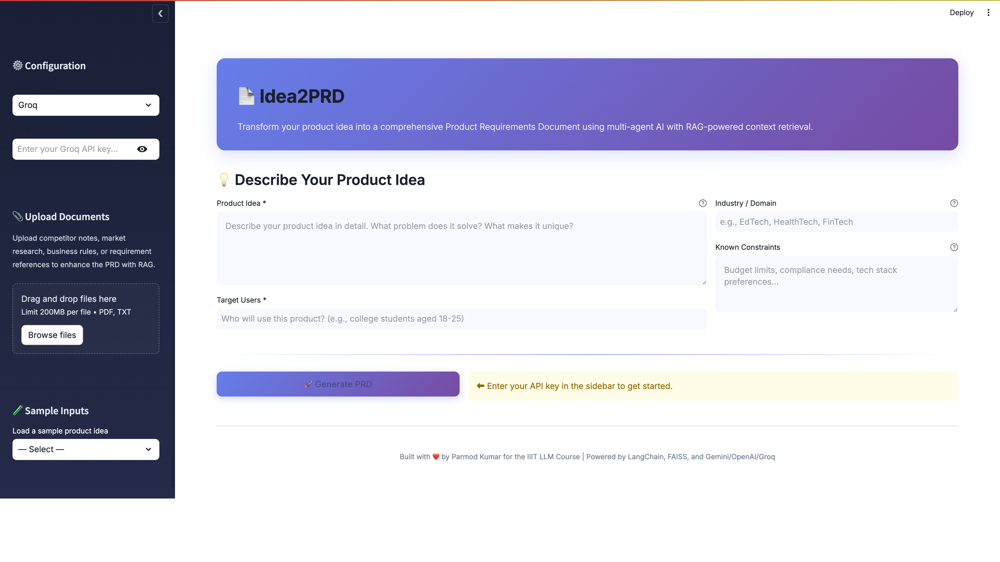
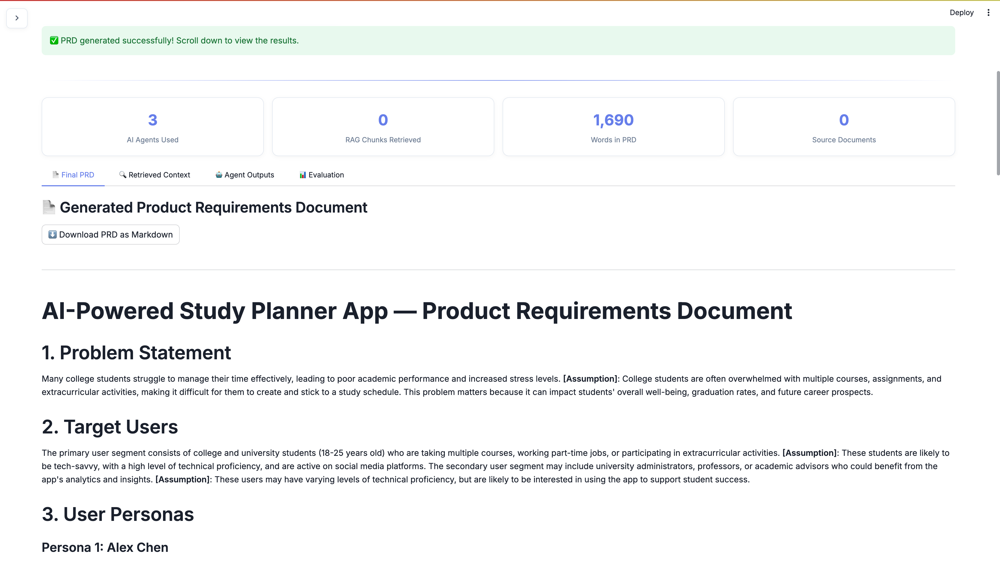
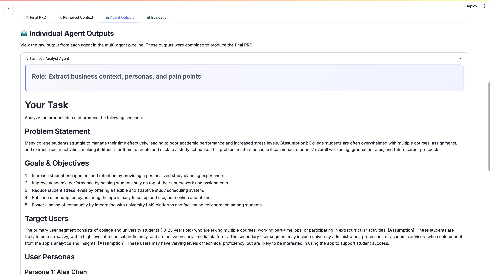
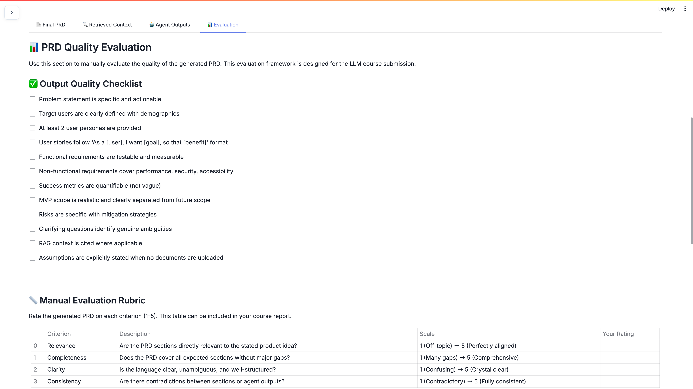

# Idea2PRD — Multi-Agent Product Requirement Generator

> **Course Project**: IIIT LLM Course  
> Transform a short product idea into a comprehensive Product Requirements Document using multi-agent AI with RAG-powered context retrieval.

---

## 🎯 Overview

**Idea2PRD** is a Streamlit web application that converts a brief product idea into a structured, professional-grade Product Requirements Document (PRD). It uses a multi-agent architecture powered by LLMs (Gemini or OpenAI) where three specialized AI agents collaborate sequentially:

1. **Business Analyst Agent** — Extracts problem context, target users, personas, and pain points
2. **Product Manager Agent** — Generates user stories, functional/non-functional requirements, and MVP scope
3. **Risk Reviewer Agent** — Identifies risks, ambiguities, missing requirements, and clarifying questions

The system supports **RAG (Retrieval-Augmented Generation)** — users can upload supporting documents (competitor analyses, market research, business rules) that are chunked, embedded, and retrieved to ground the PRD in real context.

---

## ✨ Features

| Feature | Description |
|---------|-------------|
| 🤖 Multi-Agent Pipeline | 3 specialized agents (BA, PM, Risk) running sequentially |
| 📄 RAG Support | Upload PDF/TXT documents for context-grounded generation |
| 🔍 Citation Tracking | Shows which parts of the PRD used retrieved document context |
| 📊 Evaluation Framework | Built-in quality checklist and manual evaluation rubric |
| ⬇️ Export | Download the generated PRD as a Markdown file |
| 🧪 Sample Inputs | 3 pre-built product ideas for quick testing |
| 🔑 Multi-LLM Support | Works with Google Gemini, OpenAI, and Groq APIs |
| 🎨 Professional UI | Clean, polished Streamlit interface with custom styling |

---

## 🏗️ Architecture

```
User Input (Idea + Users + Domain + Constraints)
        │
        ▼
┌─────────────────────────────────────────┐
│           Streamlit Frontend            │
│  (Sidebar: Config, Upload, Samples)     │
│  (Main: Input Form, Results Tabs)       │
└───────────┬─────────────────────────────┘
            │
            ▼
┌─────────────────────────────────────────┐
│         RAG Pipeline (rag_utils.py)     │
│  PDF/TXT Parsing → Chunking → FAISS    │
│  → Similarity Search → Context         │
└───────────┬─────────────────────────────┘
            │
            ▼
┌─────────────────────────────────────────┐
│    Multi-Agent Workflow (agents.py)     │
│                                         │
│  ┌─────────────┐                       │
│  │  Business    │──→ Problem Statement  │
│  │  Analyst     │   Personas, Pain Pts  │
│  └──────┬──────┘                       │
│         ▼                               │
│  ┌─────────────┐                       │
│  │  Product     │──→ User Stories,      │
│  │  Manager     │   Requirements, MVP   │
│  └──────┬──────┘                       │
│         ▼                               │
│  ┌─────────────┐                       │
│  │  Risk        │──→ Risks, Gaps,       │
│  │  Reviewer    │   Clarifying Qs       │
│  └──────┬──────┘                       │
│         ▼                               │
│  ┌─────────────┐                       │
│  │  Compiler    │──→ Final Merged PRD   │
│  └─────────────┘                       │
└───────────┬─────────────────────────────┘
            │
            ▼
┌─────────────────────────────────────────┐
│     LLM (Gemini 2.0 Flash / GPT-4o)    │
└─────────────────────────────────────────┘
            │
            ▼
   📄 Structured PRD Output
   (12 sections, citations, export)
```

For the detailed architecture, see [architecture.md](architecture.md).

---

## 🚀 Setup & Installation

### Prerequisites
- Python 3.10+
- A Google Gemini API key ([Get one free](https://aistudio.google.com/app/apikey)) or an OpenAI API key or Grok Api key

### Steps

```bash
# 1. Clone the repository
git clone <your-repo-url>
cd Idea-prd

# 2. Create a virtual environment (recommended)
python -m venv venv
source venv/bin/activate        # macOS/Linux
# venv\Scripts\activate         # Windows

# 3. Install dependencies
pip install -r requirements.txt

# 4. Run the application
streamlit run app.py
```

### Quick Start
1. Open the app in your browser (usually `http://localhost:8501`)
2. Enter your Gemini or OpenAI API key in the sidebar
3. Select a sample input from the sidebar dropdown (or type your own idea)
4. Optionally upload the sample documents from the `sample_data/` folder
5. Click **🚀 Generate PRD**
6. Explore the results across all 4 tabs

---

## 📂 Project Structure

```
Idea-prd/
├── app.py                  # Main Streamlit application
├── agents.py               # Multi-agent workflow (BA, PM, Risk)
├── prompts.py              # All structured system prompts
├── rag_utils.py            # PDF/TXT parsing, chunking, FAISS, retrieval
├── config.py               # App configuration and constants
├── requirements.txt        # Python dependencies
├── README.md               # This file
├── architecture.md         # Detailed architecture document
├── sample_data/
│   ├── competitor_analysis.txt
│   ├── market_research.txt
│   └── business_rules.txt
└── .streamlit/
    └── config.toml         # Streamlit theme configuration
```

---

## 📸 Screenshots

> *Screenshots to be added after first run*

| Screen | Description |
|--------|-------------|
|  | Product idea input form |
|  | Generated PRD output |
|  | Retrieved document chunks |
|  | Individual agent results |
|  | Quality evaluation framework |

---

## 🧪 Demo Script

Follow this script to demonstrate the full capabilities:

1. **Start the app**: `streamlit run app.py`
2. **Configure**: Enter your Gemini API key in the sidebar
3. **Upload documents**: Upload all 3 files from `sample_data/`
4. **Load sample input**: Select "🎓 AI Study Planner" from the sidebar
5. **Generate**: Click "🚀 Generate PRD"
6. **Review tabs**:
   - **Final PRD**: Show the complete, merged document
   - **Retrieved Context**: Highlight the chunks retrieved from uploaded docs
   - **Agent Outputs**: Expand each agent to show their individual analysis
   - **Evaluation**: Walk through the quality checklist
7. **Export**: Download the PRD as markdown
8. **Compare**: Run again without uploaded documents — note the "[Assumption]" markers

---

## 🛠️ Key Technical Concepts

### Prompt Engineering
- **Structured system prompts** with explicit output format requirements
- **Role-based personas** for each agent (Business Analyst, Product Manager, Risk Reviewer)
- **Guardrails** against hallucination: agents must cite sources or mark assumptions
- **Consistent markdown formatting** enforced across all agent outputs

### RAG (Retrieval-Augmented Generation)
- Documents are parsed (PDF via PyPDF2, TXT via UTF-8 decode)
- Text is chunked using LangChain's `RecursiveCharacterTextSplitter` (1000 chars, 200 overlap)
- Chunks are embedded using Google's `embedding-001` or OpenAI's `text-embedding-3-small`
- FAISS index enables fast similarity search
- Top-5 chunks are retrieved per agent query and injected into prompts

### Multi-Agent Architecture
- Sequential pipeline: BA → PM → Risk → Compiler
- Each agent receives prior agents' outputs as context
- Each agent gets independently retrieved RAG context
- Final compiler merges all outputs into a cohesive document

---

## ⚠️ Limitations

- **Token limits**: Very long documents may be truncated during chunking
- **Single LLM**: All agents use the same model (no specialized models per agent)
- **No memory**: Agents don't retain context between sessions
- **English only**: Prompts and output are optimized for English
- **No iterative refinement**: No feedback loop for PRD improvement
- **RAG quality**: Effectiveness depends on document quality and relevance to the idea

---

## 🔮 Future Improvements

- Iterative refinement with user feedback
- Support for DOCX, HTML, and URL ingestion
- Agent-to-agent debate for conflict resolution
- Semantic caching for repeated queries
- PRD comparison mode (with vs. without RAG)
- PDF export with professional formatting
- Industry-specific prompt templates
- Multi-language support

---

## 📝 License

This project is created for academic purposes as part of the IIIT LLM Course.

---

*Built with ❤️ by Parmod Kumar using LangChain, FAISS, Streamlit, and Gemini/OpenAI/groq*
